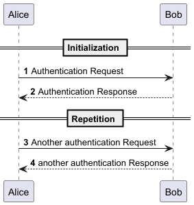

# Hello Vue Developer (hello-vue-developer)

## Overview
A Vue application illustrating core concepts like components, props, and events within a domain-driven design.

**Author**: Web Application Development Team

## Purpose

This project showcases:
- Component-based architecture with the Composition API.
- Event-driven communication (e.g., registration events).
- Reactive state management.
- A Greetings bounded context with a clear model and components.

## Features

- **Register**: Developers provide first and last names to register as Vue developers.
- **Greet**: Welcomes the last registered developer with their full name (appears only after registration).
- **Track**: Counts valid registrations for stakeholders (ignores invalid inputs).
- **Defer**: Allows developers to skip registration and try again later.
- **Validation**: Rejects empty or spaces-only names with feedback.

## User Stories
Detailed requirements for the app’s functionality, including registration, greeting, tracking, and deferral, are described in [docs/user-stories.md](docs/user-stories.md).

## Class Diagram
A PlantUML file to illustrate the app’s structure, including the Developer entity and Vue components in the Greetings bounded context, is available in [docs/class-diagram.puml](docs/class-diagram.puml).
The following is the corresponding class diagram:



## Setup

### Prerequisites
- Node.js (v22 or higher)
- npm (v11 or higher)

### Installation
1. Clone the repository:
   ```bash
   git clone <repository-url>
   cd hello-vue-developer
    ```
2. Install dependencies:
    ```bash
    npm install
    ```
3. Start the development server:
    ```bash
    npm run dev
    ```
4. Open the app in your browser (typically [http://localhost:5173](http://localhost:5173)).